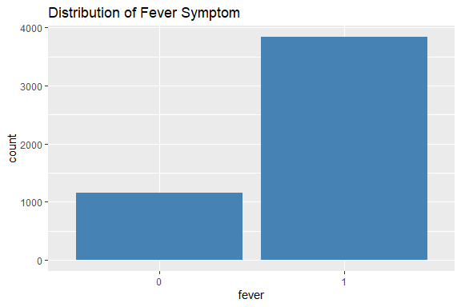
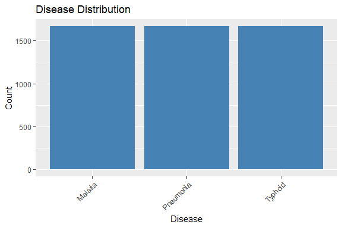
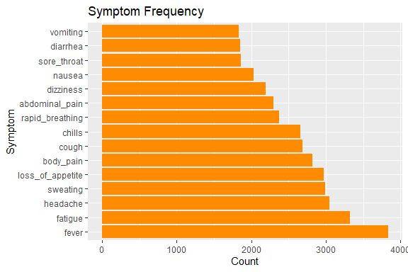
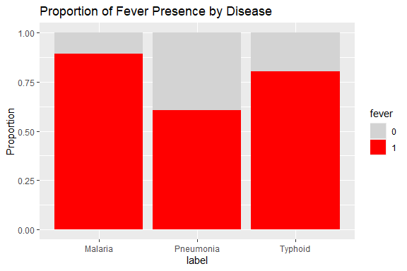
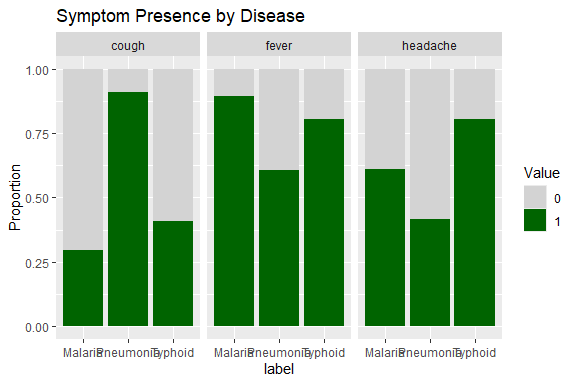
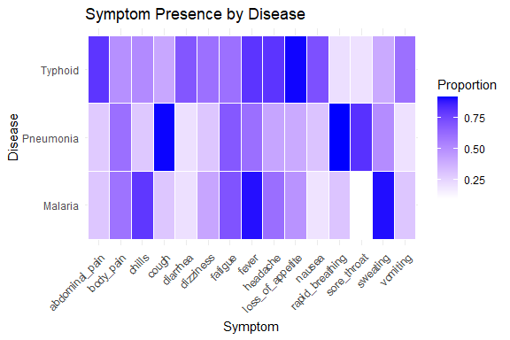
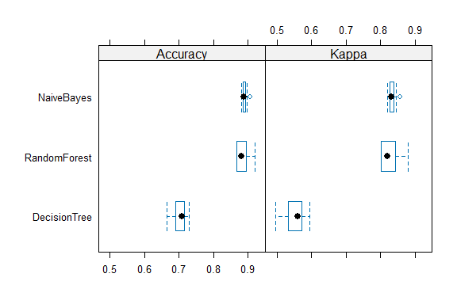
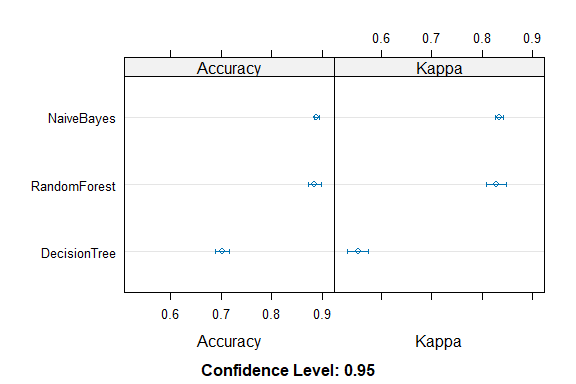

Symptom-Based Disease Prediction
================
Trevor Okinda
2025

- [Student Details](#student-details)
- [Setup Chunk](#setup-chunk)
- [Understanding the Dataset (Exploratory Data Analysis
  (EDA))](#understanding-the-dataset-exploratory-data-analysis-eda)
  - [Loading the Dataset](#loading-the-dataset)
    - [Source:](#source)
    - [Reference:](#reference)
- [Exploratory Data Analysis](#exploratory-data-analysis)
  - [Load dataset](#load-dataset)
  - [Measures of Frequency](#measures-of-frequency)
  - [Measures of Distribution](#measures-of-distribution)
  - [Measures of Relationship](#measures-of-relationship)
  - [Plots](#plots)
- [Training Model](#training-model)
  - [Data Splitting](#data-splitting)
  - [Bootstrapping](#bootstrapping)
  - [Model Training](#model-training)
  - [Model Resamples](#model-resamples)

# Student Details

|                       |                                          |
|-----------------------|------------------------------------------|
| **Student ID Number** | 134780                                   |
| **Student Name**      | Trevor Okinda                            |
| **BBIT 4.2 Group**    | C                                        |
| **Project Name**      | A Symptom-Based disease prediction model |

# Setup Chunk

**Note:** the following KnitR options have been set as the global
defaults: <BR>
`knitr::opts_chunk$set(echo = TRUE, warning = FALSE, eval = TRUE, collapse = FALSE, tidy = TRUE)`.

More KnitR options are documented here
<https://bookdown.org/yihui/rmarkdown-cookbook/chunk-options.html> and
here <https://yihui.org/knitr/options/>.

# Understanding the Dataset (Exploratory Data Analysis (EDA))

## Loading the Dataset

### Source:

The dataset that was used can be downloaded here: *\<<a
href="https://www.kaggle.com/datasets/miltonmacgyver/symptom-based-disease-prediction-dataset\"
class="uri">https://www.kaggle.com/datasets/miltonmacgyver/symptom-based-disease-prediction-dataset\</a>\>*

### Reference:

*\*MiltonMacGyver. (n.d.). Symptom-Based Disease Prediction Dataset
\[Data set\]. Kaggle.
<https://www.kaggle.com/datasets/miltonmacgyver/symptom-based-disease-prediction-dataset>*
\>  

Refer to the APA 7th edition manual for rules on how to cite datasets:
<https://apastyle.apa.org/style-grammar-guidelines/references/examples/data-set-references>\*

# Exploratory Data Analysis

## Load dataset

``` r
# Load libraries
library(tidyverse)
```

    ## ── Attaching core tidyverse packages ──────────────────────── tidyverse 2.0.0 ──
    ## ✔ dplyr     1.1.4     ✔ readr     2.1.5
    ## ✔ forcats   1.0.0     ✔ stringr   1.5.1
    ## ✔ ggplot2   3.5.2     ✔ tibble    3.3.0
    ## ✔ lubridate 1.9.4     ✔ tidyr     1.3.1
    ## ✔ purrr     1.1.0     
    ## ── Conflicts ────────────────────────────────────────── tidyverse_conflicts() ──
    ## ✖ dplyr::filter() masks stats::filter()
    ## ✖ dplyr::lag()    masks stats::lag()
    ## ℹ Use the conflicted package (<http://conflicted.r-lib.org/>) to force all conflicts to become errors

``` r
# Choose and load dataset with correct column types
file_path <- file.choose()

SymptomData <- read.csv(file_path, colClasses = c(
  fever = "factor",
  cough = "factor",
  headache = "factor",
  nausea = "factor",
  vomiting = "factor",
  fatigue = "factor",
  sore_throat = "factor",
  chills = "factor",
  body_pain = "factor",
  loss_of_appetite = "factor",
  abdominal_pain = "factor",
  diarrhea = "factor",
  sweating = "factor",
  rapid_breathing = "factor",
  dizziness = "factor",
  label = "factor" # Target variable
))

# Quick check
str(SymptomData)
```

    ## 'data.frame':    4998 obs. of  16 variables:
    ##  $ fever           : Factor w/ 2 levels "0","1": 2 2 2 2 2 1 2 2 1 2 ...
    ##  $ cough           : Factor w/ 2 levels "0","1": 2 1 2 2 2 2 1 2 1 2 ...
    ##  $ headache        : Factor w/ 2 levels "0","1": 2 2 2 2 2 1 2 2 1 2 ...
    ##  $ nausea          : Factor w/ 2 levels "0","1": 2 1 2 2 2 1 1 1 1 2 ...
    ##  $ vomiting        : Factor w/ 2 levels "0","1": 1 2 2 1 2 1 2 1 1 1 ...
    ##  $ fatigue         : Factor w/ 2 levels "0","1": 1 1 2 2 1 2 2 2 1 2 ...
    ##  $ sore_throat     : Factor w/ 2 levels "0","1": 1 2 1 1 1 2 1 2 1 2 ...
    ##  $ chills          : Factor w/ 2 levels "0","1": 2 2 1 1 2 1 2 1 1 1 ...
    ##  $ body_pain       : Factor w/ 2 levels "0","1": 2 1 1 1 2 2 1 1 2 2 ...
    ##  $ loss_of_appetite: Factor w/ 2 levels "0","1": 2 1 2 1 1 1 2 1 1 1 ...
    ##  $ abdominal_pain  : Factor w/ 2 levels "0","1": 2 2 2 1 2 1 2 2 1 1 ...
    ##  $ diarrhea        : Factor w/ 2 levels "0","1": 1 1 2 1 2 1 2 2 1 1 ...
    ##  $ sweating        : Factor w/ 2 levels "0","1": 1 2 2 2 2 1 1 1 2 1 ...
    ##  $ rapid_breathing : Factor w/ 2 levels "0","1": 1 2 1 1 1 2 1 1 1 2 ...
    ##  $ dizziness       : Factor w/ 2 levels "0","1": 1 1 2 1 2 1 2 2 1 1 ...
    ##  $ label           : Factor w/ 3 levels "Malaria","Pneumonia",..: 3 1 3 1 3 2 3 3 1 2 ...

``` r
summary(SymptomData)
```

    ##  fever    cough    headache nausea   vomiting fatigue  sore_throat chills  
    ##  0:1161   0:2313   0:1950   0:2968   0:3162   0:1676   0:3137      0:2338  
    ##  1:3837   1:2685   1:3048   1:2030   1:1836   1:3322   1:1861      1:2660  
    ##                                                                            
    ##  body_pain loss_of_appetite abdominal_pain diarrhea sweating rapid_breathing
    ##  0:2179    0:2027           0:2696         0:3148   0:2007   0:2621         
    ##  1:2819    1:2971           1:2302         1:1850   1:2991   1:2377         
    ##                                                                             
    ##  dizziness       label     
    ##  0:2807    Malaria  :1666  
    ##  1:2191    Pneumonia:1666  
    ##            Typhoid  :1666

``` r
# Frequency of each disease label
table(SymptomData$label)
```

    ## 
    ##   Malaria Pneumonia   Typhoid 
    ##      1666      1666      1666

## Measures of Frequency

``` r
# Frequency of each disease label
table(SymptomData$label)
```

    ## 
    ##   Malaria Pneumonia   Typhoid 
    ##      1666      1666      1666

``` r
# Frequency of each symptom being present (1) or absent (0)
symptom_freq <- sapply(SymptomData[ , -ncol(SymptomData)], function(col) table(col))
symptom_freq
```

    ##   fever cough headache nausea vomiting fatigue sore_throat chills body_pain
    ## 0  1161  2313     1950   2968     3162    1676        3137   2338      2179
    ## 1  3837  2685     3048   2030     1836    3322        1861   2660      2819
    ##   loss_of_appetite abdominal_pain diarrhea sweating rapid_breathing dizziness
    ## 0             2027           2696     3148     2007            2621      2807
    ## 1             2971           2302     1850     2991            2377      2191

## Measures of Distribution

``` r
# Convert factors to numeric (0/1) for calculation
symptom_numeric <- SymptomData %>%
  mutate(across(-label, ~ as.numeric(as.character(.))))

# Mean presence of each symptom
colMeans(symptom_numeric[ , -ncol(symptom_numeric)])
```

    ##            fever            cough         headache           nausea 
    ##        0.7677071        0.5372149        0.6098439        0.4061625 
    ##         vomiting          fatigue      sore_throat           chills 
    ##        0.3673469        0.6646659        0.3723489        0.5322129 
    ##        body_pain loss_of_appetite   abdominal_pain         diarrhea 
    ##        0.5640256        0.5944378        0.4605842        0.3701481 
    ##         sweating  rapid_breathing        dizziness 
    ##        0.5984394        0.4755902        0.4383754

``` r
# Distribution for each symptom
summary(symptom_numeric[ , -ncol(symptom_numeric)])
```

    ##      fever            cough           headache          nausea      
    ##  Min.   :0.0000   Min.   :0.0000   Min.   :0.0000   Min.   :0.0000  
    ##  1st Qu.:1.0000   1st Qu.:0.0000   1st Qu.:0.0000   1st Qu.:0.0000  
    ##  Median :1.0000   Median :1.0000   Median :1.0000   Median :0.0000  
    ##  Mean   :0.7677   Mean   :0.5372   Mean   :0.6098   Mean   :0.4062  
    ##  3rd Qu.:1.0000   3rd Qu.:1.0000   3rd Qu.:1.0000   3rd Qu.:1.0000  
    ##  Max.   :1.0000   Max.   :1.0000   Max.   :1.0000   Max.   :1.0000  
    ##     vomiting         fatigue        sore_throat         chills      
    ##  Min.   :0.0000   Min.   :0.0000   Min.   :0.0000   Min.   :0.0000  
    ##  1st Qu.:0.0000   1st Qu.:0.0000   1st Qu.:0.0000   1st Qu.:0.0000  
    ##  Median :0.0000   Median :1.0000   Median :0.0000   Median :1.0000  
    ##  Mean   :0.3673   Mean   :0.6647   Mean   :0.3723   Mean   :0.5322  
    ##  3rd Qu.:1.0000   3rd Qu.:1.0000   3rd Qu.:1.0000   3rd Qu.:1.0000  
    ##  Max.   :1.0000   Max.   :1.0000   Max.   :1.0000   Max.   :1.0000  
    ##    body_pain     loss_of_appetite abdominal_pain      diarrhea     
    ##  Min.   :0.000   Min.   :0.0000   Min.   :0.0000   Min.   :0.0000  
    ##  1st Qu.:0.000   1st Qu.:0.0000   1st Qu.:0.0000   1st Qu.:0.0000  
    ##  Median :1.000   Median :1.0000   Median :0.0000   Median :0.0000  
    ##  Mean   :0.564   Mean   :0.5944   Mean   :0.4606   Mean   :0.3701  
    ##  3rd Qu.:1.000   3rd Qu.:1.0000   3rd Qu.:1.0000   3rd Qu.:1.0000  
    ##  Max.   :1.000   Max.   :1.0000   Max.   :1.0000   Max.   :1.0000  
    ##     sweating      rapid_breathing    dizziness     
    ##  Min.   :0.0000   Min.   :0.0000   Min.   :0.0000  
    ##  1st Qu.:0.0000   1st Qu.:0.0000   1st Qu.:0.0000  
    ##  Median :1.0000   Median :0.0000   Median :0.0000  
    ##  Mean   :0.5984   Mean   :0.4756   Mean   :0.4384  
    ##  3rd Qu.:1.0000   3rd Qu.:1.0000   3rd Qu.:1.0000  
    ##  Max.   :1.0000   Max.   :1.0000   Max.   :1.0000

## Measures of Relationship

``` r
# Visual distribution for one example symptom
library(ggplot2)
ggplot(SymptomData, aes(x = fever)) +
  geom_bar(fill = "steelblue") +
  labs(title = "Distribution of Fever Symptom")
```

<!-- -->

``` r
# Chi-square test for fever vs disease
chisq.test(table(SymptomData$fever, SymptomData$label))
```

    ## 
    ##  Pearson's Chi-squared test
    ## 
    ## data:  table(SymptomData$fever, SymptomData$label)
    ## X-squared = 408.15, df = 2, p-value < 2.2e-16

``` r
# Cramér's V for all symptoms vs label
library(DescTools)
cramers_v <- sapply(SymptomData[ , -ncol(SymptomData)], function(symptom) {
  CramerV(table(symptom, SymptomData$label))
})
cramers_v
```

    ##            fever            cough         headache           nausea 
    ##        0.2857663        0.5354529        0.3260371        0.4520878 
    ##         vomiting          fatigue      sore_throat           chills 
    ##        0.3538901        0.0946911        0.6527516        0.4148242 
    ##        body_pain loss_of_appetite   abdominal_pain         diarrhea 
    ##        0.1056598        0.4562472        0.4861008        0.4758475 
    ##         sweating  rapid_breathing        dizziness 
    ##        0.4393114        0.6238732        0.2539692

## Plots

``` r
library(ggplot2)

ggplot(SymptomData, aes(x = label)) +
  geom_bar(fill = "steelblue") +
  labs(title = "Disease Distribution", x = "Disease", y = "Count") +
  theme(axis.text.x = element_text(angle = 45, hjust = 1))
```

<!-- -->

``` r
# Convert to numeric for counting
symptom_numeric <- SymptomData %>%
  mutate(across(-label, ~ as.numeric(as.character(.))))

symptom_counts <- colSums(symptom_numeric[ , -ncol(symptom_numeric)] == 1)

symptom_df <- data.frame(
  Symptom = names(symptom_counts),
  Count = as.numeric(symptom_counts)
)

ggplot(symptom_df, aes(x = reorder(Symptom, -Count), y = Count)) +
  geom_bar(stat = "identity", fill = "darkorange") +
  coord_flip() +
  labs(title = "Symptom Frequency", x = "Symptom", y = "Count")
```

<!-- -->

``` r
# Example: Fever vs Disease
ggplot(SymptomData, aes(x = label, fill = fever)) +
  geom_bar(position = "fill") +
  labs(title = "Proportion of Fever Presence by Disease",
       y = "Proportion") +
  scale_fill_manual(values = c("0" = "lightgray", "1" = "red"))
```

<!-- -->

``` r
# Choose a few symptoms to display
selected_symptoms <- c("fever", "cough", "headache")

SymptomData %>%
  pivot_longer(cols = all_of(selected_symptoms), names_to = "Symptom", values_to = "Value") %>%
  ggplot(aes(x = label, fill = Value)) +
  geom_bar(position = "fill") +
  facet_wrap(~ Symptom) +
  labs(title = "Symptom Presence by Disease", y = "Proportion") +
  scale_fill_manual(values = c("0" = "lightgray", "1" = "darkgreen"))
```

<!-- -->

``` r
library(tidyverse)

label_col <- "label"

# Convert symptom columns to numeric (keep label as factor)
symptom_numeric <- SymptomData %>%
  mutate(across(setdiff(names(SymptomData), label_col), ~ as.numeric(as.character(.))))

# Group by label and calculate mean (proportion of '1's)
symptom_summary <- symptom_numeric %>%
  group_by(.data[[label_col]]) %>%
  summarise(across(setdiff(names(symptom_numeric), label_col), mean), .groups = "drop") %>%
  pivot_longer(-.data[[label_col]], names_to = "Symptom", values_to = "Proportion")

# Heatmap
ggplot(symptom_summary, aes(x = Symptom, y = .data[[label_col]], fill = Proportion)) +
  geom_tile(color = "white") +
  scale_fill_gradient(low = "white", high = "blue") +
  labs(title = "Symptom Presence by Disease",
       x = "Symptom",
       y = "Disease",
       fill = "Proportion") +
  theme_minimal() +
  theme(axis.text.x = element_text(angle = 45, hjust = 1))
```

<!-- --> \#
Preprocessing and Data Transformation \## Missing Values

``` r
# Count missing values per column
colSums(is.na(SymptomData))
```

    ##            fever            cough         headache           nausea 
    ##                0                0                0                0 
    ##         vomiting          fatigue      sore_throat           chills 
    ##                0                0                0                0 
    ##        body_pain loss_of_appetite   abdominal_pain         diarrhea 
    ##                0                0                0                0 
    ##         sweating  rapid_breathing        dizziness            label 
    ##                0                0                0                0

``` r
# Total missing values in dataset
sum(is.na(SymptomData))
```

    ## [1] 0

# Training Model

## Data Splitting

``` r
library(caret)
```

    ## Loading required package: lattice

    ## 
    ## Attaching package: 'caret'

    ## The following objects are masked from 'package:DescTools':
    ## 
    ##     MAE, RMSE

    ## The following object is masked from 'package:purrr':
    ## 
    ##     lift

``` r
set.seed(123)  # For reproducibility

# 80/20 split
train_index <- createDataPartition(SymptomData$label, p = 0.8, list = FALSE)
train_data <- SymptomData[train_index, ]
test_data  <- SymptomData[-train_index, ]

dim(train_index)
```

    ## [1] 3999    1

``` r
dim(train_data)
```

    ## [1] 3999   16

## Bootstrapping

``` r
ctrl_boot <- trainControl(method = "boot", number = 50)  # 50 bootstrap resamples
print(ctrl_boot)
```

    ## $method
    ## [1] "boot"
    ## 
    ## $number
    ## [1] 50
    ## 
    ## $repeats
    ## [1] NA
    ## 
    ## $search
    ## [1] "grid"
    ## 
    ## $p
    ## [1] 0.75
    ## 
    ## $initialWindow
    ## NULL
    ## 
    ## $horizon
    ## [1] 1
    ## 
    ## $fixedWindow
    ## [1] TRUE
    ## 
    ## $skip
    ## [1] 0
    ## 
    ## $verboseIter
    ## [1] FALSE
    ## 
    ## $returnData
    ## [1] TRUE
    ## 
    ## $returnResamp
    ## [1] "final"
    ## 
    ## $savePredictions
    ## [1] FALSE
    ## 
    ## $classProbs
    ## [1] FALSE
    ## 
    ## $summaryFunction
    ## function (data, lev = NULL, model = NULL) 
    ## {
    ##     if (is.character(data$obs)) 
    ##         data$obs <- factor(data$obs, levels = lev)
    ##     postResample(data[, "pred"], data[, "obs"])
    ## }
    ## <bytecode: 0x000001300a09c9b0>
    ## <environment: namespace:caret>
    ## 
    ## $selectionFunction
    ## [1] "best"
    ## 
    ## $preProcOptions
    ## $preProcOptions$thresh
    ## [1] 0.95
    ## 
    ## $preProcOptions$ICAcomp
    ## [1] 3
    ## 
    ## $preProcOptions$k
    ## [1] 5
    ## 
    ## $preProcOptions$freqCut
    ## [1] 19
    ## 
    ## $preProcOptions$uniqueCut
    ## [1] 10
    ## 
    ## $preProcOptions$cutoff
    ## [1] 0.9
    ## 
    ## 
    ## $sampling
    ## NULL
    ## 
    ## $index
    ## NULL
    ## 
    ## $indexOut
    ## NULL
    ## 
    ## $indexFinal
    ## NULL
    ## 
    ## $timingSamps
    ## [1] 0
    ## 
    ## $predictionBounds
    ## [1] FALSE FALSE
    ## 
    ## $seeds
    ## [1] NA
    ## 
    ## $adaptive
    ## $adaptive$min
    ## [1] 5
    ## 
    ## $adaptive$alpha
    ## [1] 0.05
    ## 
    ## $adaptive$method
    ## [1] "gls"
    ## 
    ## $adaptive$complete
    ## [1] TRUE
    ## 
    ## 
    ## $trim
    ## [1] FALSE
    ## 
    ## $allowParallel
    ## [1] TRUE

``` r
ctrl_cv <- trainControl(method = "cv", number = 10)
print(ctrl_cv)
```

    ## $method
    ## [1] "cv"
    ## 
    ## $number
    ## [1] 10
    ## 
    ## $repeats
    ## [1] NA
    ## 
    ## $search
    ## [1] "grid"
    ## 
    ## $p
    ## [1] 0.75
    ## 
    ## $initialWindow
    ## NULL
    ## 
    ## $horizon
    ## [1] 1
    ## 
    ## $fixedWindow
    ## [1] TRUE
    ## 
    ## $skip
    ## [1] 0
    ## 
    ## $verboseIter
    ## [1] FALSE
    ## 
    ## $returnData
    ## [1] TRUE
    ## 
    ## $returnResamp
    ## [1] "final"
    ## 
    ## $savePredictions
    ## [1] FALSE
    ## 
    ## $classProbs
    ## [1] FALSE
    ## 
    ## $summaryFunction
    ## function (data, lev = NULL, model = NULL) 
    ## {
    ##     if (is.character(data$obs)) 
    ##         data$obs <- factor(data$obs, levels = lev)
    ##     postResample(data[, "pred"], data[, "obs"])
    ## }
    ## <bytecode: 0x000001300a09c9b0>
    ## <environment: namespace:caret>
    ## 
    ## $selectionFunction
    ## [1] "best"
    ## 
    ## $preProcOptions
    ## $preProcOptions$thresh
    ## [1] 0.95
    ## 
    ## $preProcOptions$ICAcomp
    ## [1] 3
    ## 
    ## $preProcOptions$k
    ## [1] 5
    ## 
    ## $preProcOptions$freqCut
    ## [1] 19
    ## 
    ## $preProcOptions$uniqueCut
    ## [1] 10
    ## 
    ## $preProcOptions$cutoff
    ## [1] 0.9
    ## 
    ## 
    ## $sampling
    ## NULL
    ## 
    ## $index
    ## NULL
    ## 
    ## $indexOut
    ## NULL
    ## 
    ## $indexFinal
    ## NULL
    ## 
    ## $timingSamps
    ## [1] 0
    ## 
    ## $predictionBounds
    ## [1] FALSE FALSE
    ## 
    ## $seeds
    ## [1] NA
    ## 
    ## $adaptive
    ## $adaptive$min
    ## [1] 5
    ## 
    ## $adaptive$alpha
    ## [1] 0.05
    ## 
    ## $adaptive$method
    ## [1] "gls"
    ## 
    ## $adaptive$complete
    ## [1] TRUE
    ## 
    ## 
    ## $trim
    ## [1] FALSE
    ## 
    ## $allowParallel
    ## [1] TRUE

## Model Training

``` r
# Logistic Regression
# Naive Bayes
model_nb <- train( label ~ .,  data = train_data, method = "naive_bayes", trControl = ctrl_cv )

# Decision Tree
model_tree <- train( label ~ .,  data = train_data, method = "rpart", trControl = ctrl_cv )

# Random Forest
model_rf <- train( label ~ .,  data = train_data, method = "rf", trControl = ctrl_cv )
```

## Model Resamples

``` r
results <- resamples(list(
  NaiveBayes = model_nb,
  DecisionTree = model_tree,
  RandomForest = model_rf
))

summary(results)
```

    ## 
    ## Call:
    ## summary.resamples(object = results)
    ## 
    ## Models: NaiveBayes, DecisionTree, RandomForest 
    ## Number of resamples: 10 
    ## 
    ## Accuracy 
    ##                   Min.   1st Qu.    Median      Mean   3rd Qu.  Max. NA's
    ## NaiveBayes   0.8800000 0.8847838 0.8876403 0.8892198 0.8918750 0.905    0
    ## DecisionTree 0.6641604 0.6925423 0.7078709 0.7026540 0.7145542 0.730    0
    ## RandomForest 0.8671679 0.8705498 0.8801496 0.8854690 0.8923743 0.920    0
    ## 
    ## Kappa 
    ##                   Min.   1st Qu.    Median      Mean   3rd Qu.      Max. NA's
    ## NaiveBayes   0.8199938 0.8271763 0.8314578 0.8338303 0.8378004 0.8575232    0
    ## DecisionTree 0.4962406 0.5388587 0.5618647 0.5539850 0.5717565 0.5948569    0
    ## RandomForest 0.8007519 0.8058196 0.8202250 0.8282006 0.8385632 0.8799947    0

``` r
bwplot(results)
```

<!-- -->

``` r
dotplot(results)
```

<!-- -->
